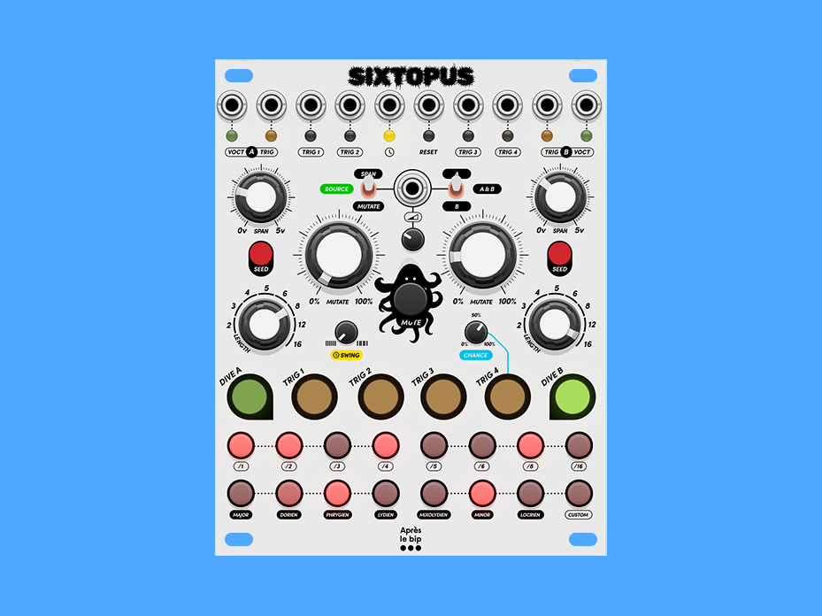

# Sixtopus — User Manual

**Version 2.0 · Dual Turing Machine Sequencer · 20HP · VCV Rack 2**



---

## 👋 Welcome

Sixtopus is a generative sequencer. That means instead of programming every note by hand, you set a few parameters, patch it up, and let it run — then you listen and respond. Some of the best musical moments you'll have with this module will be complete surprises.

At its heart are two independent melodic voices called **DIVE channels** (A and B), each driven by a **Turing Machine** — a looping shift register that generates evolving pitch sequences. Alongside them, four **trigger channels** handle the rhythmic side of things: drums, envelopes, whatever you want to fire on a beat.

All six channels share a 16-step grid and a common clock, but each one has its own length, speed, and scale. One module can carry a whole patch.

Don't worry if some of this is new to you — we'll walk through everything step by step.

---

## ⚡ First things first — the clock

Sixtopus needs a clock to run. Connect a clock source to the **CLOCK** jack. **One pulse = one step.** Every time a pulse arrives, the sequencer moves forward by exactly one step. Simple and reliable — the module never guesses at tempo or free-runs on its own.

> If you're new to eurorack clocking: most clock modules (like Fundamental CLKD) send one pulse per 16th note by default. That means Sixtopus advances 16 steps per bar, which lines up perfectly with the 16-step grid.

> **What if I unplug the clock?** The module stops immediately. No drift, no stuck notes. Plug it back in and it picks up from where it left off.

Without a clock, nothing moves. Once you've got a clock patched in, you're ready to go.

---

## 🗺️ Panel overview

```
OUTPUTS ──────────────────────────────────────────────────────────────────
[VOCT A] [GATE A] [TRIG 1] [TRIG 2]              [TRIG 3] [TRIG 4] [GATE B] [VOCT B]

CLOCK / RESET ────────────────────────────────────────────────────────────
                              [CLOCK]  [RESET]

MODULATION ──────────────────────────────────────────────────────────────
  SPAN A    [MOD_PARAM]  [CV IN]  [MOD_DEST]    SPAN B
                         [MOD ATT]

VOICE CONTROLS ──────────────────────────────────────────────────────────
 [SEED A]    MUTATE A                  MUTATE B   [SEED B]
                          [MUTE]
 LENGTH A   [SWING]                  [CHANCE]   LENGTH B

CHANNEL SELECT ──────────────────────────────────────────────────────────
  [CH1]  [CH2]  [CH3]  [CH4]  [CH5]  [CH6]

STEP GRID ───────────────────────────────────────────────────────────────
  [ 1][ 2][ 3][ 4][ 5][ 6][ 7][ 8]
  [ 9][10][11][12][13][14][15][16]
```

| Button | Channel | Type | LED |
|--------|---------|------|-----|
| CH1 | DIVE A | Melodic — Turing Machine + quantizer | 🟢 Green |
| CH2 | TRIG 1 | Trigger | 🟡 Yellow |
| CH3 | TRIG 2 | Trigger | 🟡 Yellow |
| CH4 | TRIG 3 | Trigger | 🟡 Yellow |
| CH5 | TRIG 4 | Trigger with probability | 🟡 Yellow |
| CH6 | DIVE B | Melodic — Turing Machine + quantizer | 🟢 Green |

The illuminated buttons colour-code each channel at a glance: **green** for the two melodic DIVE voices, **yellow** for the four trigger channels. The selected channel glows bright, the others stay dim — and an unselected channel **blinks in its colour** each time it plays an active step, so you can watch all six channels working even while editing another. A muted channel goes **dark** — its LED turns off.

---

## 🌊 The DIVE channels — your melodic voices

### What's a Turing Machine?

If you haven't come across a Turing Machine before, here's the short version: it's a loop of bits (on/off values) that shifts along on every step. The voltage it outputs is derived from the current state of those bits, so you get a pitched CV that follows the loop.

What makes it special is what happens when you allow the bits to flip randomly — the pattern starts to *evolve*. Notes change one at a time, gradually. The melody you had five minutes ago is gone, but the new one grew out of it organically. It sounds alive in a way that programmed sequences rarely do.

That's the soul of Sixtopus.

### SPAN — how wide is your melody?

SPAN controls the pitch range. All the way down and your notes are clustered close together — subtle, intimate motion. All the way up and the Turing Machine roams across five octaves.

Start around noon. Adjust to taste once your oscillator is patched in and you can hear what's happening.

### MUTATE — the heart of it all

This knob is where the magic lives, and it's worth spending time with.

- **Fully counter-clockwise** — the register is locked. Whatever pattern is playing will repeat forever, exactly. Use this when the Turing Machine has landed on something you love.
- **Noon** — slow, gradual mutation. Notes change one at a time, over many cycles. The melody feels familiar but is never quite the same. This is probably where you'll spend most of your time.
- **Fully clockwise** — full random. Every step is independent. Great for quickly auditioning new material — just spin MUTATE up, wait for something interesting, then back off to freeze it.

> **A workflow that works really well:** Start with MUTATE around noon and just listen. The pattern will explore. When it stumbles onto something musical — a nice interval, a familiar shape — turn MUTATE down to lock it in. Later, nudge it back up when you want things to move again. It's a conversation.

### SEED — start fresh

Press SEED to instantly randomise the Turing Machine register. New pattern, right now. If things have wandered somewhere uninteresting, SEED is your reset button.

Don't be afraid to hit it. You can always hit it again.

### LENGTH — how long is the loop?

LENGTH sets the number of steps before the pattern repeats: **2, 3, 4, 5, 6, 8, 12, or 16**.

Short lengths (2–4) create tight, hypnotic cells. Longer lengths (12–16) give the Turing Machine room to tell a longer story. Odd lengths like 3, 5, or 6 can create interesting rhythmic tension when they run against a straight 16-step trigger channel.

> One important thing to know: **the Turing Machine advances on every step, even silent ones.** If a step in the grid is turned off, no note plays — but the register still moves forward. This keeps the mutation behaviour consistent and musical, regardless of what's active in your pattern.

### Outputs

- **VOCT A / VOCT B** — the quantized pitch. Patch this to your oscillator's V/Oct input.
- **GATE A / GATE B** — a 10ms gate on every active step. Patch to an envelope generator.

Between active steps, the V/Oct output holds its last value — your oscillator stays at the last pitch rather than dropping to zero.

---

## 🥁 The trigger channels — TRIG 1 to 4

These four channels are straightforward: each step fires a 1ms trigger pulse when it's active. Patch them to drums, envelope retriggers, clock dividers — anything that responds to a short pulse.

### Building a pattern

1. Press a **CH button** (CH2 through CH5) to select the channel.
2. The grid shows the current pattern. Bright = active, dim = inactive.
3. Press any step to toggle it on or off.

That's it. Start with a kick on steps 1, 5, 9, 13 and go from there.

### CHANCE — making TRIG 4 human

The **CHANCE** trimpot is only for TRIG 4, and it's one of the most useful controls on the module. It sets the probability that each active step actually fires.

Fully clockwise: every step fires, every time. As you turn it down, active steps start randomly skipping — you never know quite which beat will land.

> Program a four-on-the-floor pattern on TRIG 4 with CHANCE at around 65%. Suddenly your kick has ghost beats and occasional drops. It breathes. You didn't program that — the module found it for you.

---

## 💡 Reading the step grid

The 16 steps display the pattern for whichever channel is currently selected. Press any CH button to switch channels.

| LED brightness | What it means |
|---------------|---------------|
| **Full (100%)** | Active step — will fire |
| **Dim (8%)** | Inactive step in range (DIVE channels) |
| **30%** | Playhead — current position |
| **Off** | Beyond the channel's LENGTH setting |

The playhead moves across the grid in real time. Even when a step doesn't fire, you can see exactly where the sequence is.

For DIVE channels, steps beyond the LENGTH setting go dark and can't be activated. The loop boundary is always visible.

---

## 🎹 Scales and quantization

The raw Turing Machine output gets quantized to a musical scale before it reaches the V/Oct output. Each DIVE channel has its own scale — A and B can be in completely different scales at the same time.

To set the scale: **right-click the CH1 or CH6 button** → Scale.

### Built-in scales

| Scale | Degrees |
|-------|---------|
| Major | 1 2 3 4 5 6 7 |
| Dorian | 1 2 ♭3 4 5 6 ♭7 |
| Phrygian | 1 ♭2 ♭3 4 5 ♭6 ♭7 |
| Lydian | 1 2 3 ♯4 5 6 7 |
| Mixolydian | 1 2 3 4 5 6 ♭7 |
| Minor | 1 2 ♭3 4 5 ♭6 ♭7 |
| Locrian | 1 ♭2 ♭3 4 ♭5 ♭6 ♭7 |
| **Custom** | You build it |

> **Scales and MUTATE interact beautifully.** A fully random Turing Machine in Minor scale will stay melodic and moody even at maximum chaos. The quantizer is doing a lot of musical heavy lifting.

### Custom scale — your own keyboard

Select **Custom** (right-click CH1 or CH6 → Scale → Custom) and the step grid turns into a **piano keyboard** — black keys on the top row, white keys on the bottom, laid out like a real octave:

```
Top row     ·   C#  D#   ·   F#  G#  A#   ·     ← black keys (steps 2,3,5,6,7)
Bottom row  C   D   E   F   G   A   B    ·     ← white keys (steps 9–15)
```

It opens already showing the notes of the scale you were just in — switch from Major and you'll see C, D, E, F, G, A, B lit. From there you sculpt: press a key to add or remove a note. What's lit is what the quantizer allows.

When you're done, **press any channel button** to leave the keyboard and return to the step grid. The channel keeps your custom scale — pressing a channel button only switches the view, it never erases your notes. And if you open the keyboard but leave the notes exactly as you found them, the channel quietly stays on its previous scale: you won't get stuck in Custom just for looking.

Each DIVE channel remembers its own custom scale independently.

> **Leave it empty** (all keys off) and quantization is bypassed entirely. The raw Turing Machine CV passes through. Great for microtonal adventures or when you just want the chaos unfiltered.

> **A great starting point:** light up a pentatonic scale — bottom row steps 9, 10, 11, 13, 14 (C, D, E, G, A). Every random combination the Turing Machine generates will sound consonant. It's almost cheating.

---

## ⏱️ Clock, swing and reset

### Clock

Connect a standard pulse to **CLOCK**. One rising edge = one step. The module measures the time between pulses internally — this is how swing knows how much to delay.

### RESET

A rising edge on **RESET** sends all channels back to step 1 instantly. Use it to lock Sixtopus to the start of a bar, or to sync it with other sequencers in your patch. It also cancels any pending swing delay.

### Time division — independent speeds per channel

Right-click any CH button → Time Division. You can set each channel to run at a different rate relative to the clock:

| Setting | Fires every... |
|---------|---------------|
| /1 | Every pulse (default) |
| /2 | Every 2 pulses |
| /3 | Every 3 pulses |
| /4 | Every 4 pulses |
| /6 | Every 6 pulses |
| /8 | Every 8 pulses |
| /12 | Every 12 pulses |
| /16 | Every 16 pulses |

> **This is where Sixtopus gets really deep.** Set DIVE A to /1 and DIVE B to /3 — two melodies that fall in and out of phase in ways you'd never program by hand. Add a kick at /1, a snare at /2, and a slow melodic bass at /4. You've got a whole band from one module and one clock.

### Swing

The **SWING** trimpot delays every other step — the 2nd, 4th, 6th… — pushing it later toward the following beat. Fully counter-clockwise: no swing, straight timing. Noon: about 25% of a step late. Fully clockwise: ~50% — the delayed step lands halfway to the next one, a proper shuffle feel.

Swing applies to all six channels at once.

---

## 🚥 The jack LEDs

Each jack along the top row has a small 3mm LED above it, colour-coded by function and flashing with activity so you can read the module's pulse at a glance:

| LED | Jack | Colour | Lights when |
|-----|------|--------|-------------|
| VOCT A / B | pitch outs | 🟢 green | a level indicator — brightness tracks the held pitch, lit continuously |
| GATE A / B | gate outs | 🟠 orange | the voice's gate fires |
| TRIG 1–4 | trigger outs | 🟠 orange | that trigger fires |
| CLOCK | clock in | 🟡 yellow | each incoming clock pulse |
| RESET | reset in | 🔴 red | a reset edge arrives |

While the module is globally muted, the gate and trigger LEDs go dark along with their outputs. The V/Oct LEDs stay lit on the frozen pitch — their output holds rather than dropping out. The step grid keeps showing the moving playhead, so you can still see the sequences running underneath the silence.

---

## 🔇 Mute

| | |
|-|-|
| **Short tap MUTE** | Toggles global mute — silences the gates and triggers. The DIVE V/Oct outputs freeze on their last note (held, not dropped to 0V) so your oscillators don't slam to the bottom. Tap again to bring the gates back. |
| **Hold MUTE + press a track** | Mutes/unmutes that individual track. While MUTE is held, the channel buttons become per-track mute toggles instead of selectors. |
| **Right-click MUTE** | Same per-channel mutes, from a menu |

Holding MUTE on its own never mutes the module — the hold is only there to turn the track buttons into mute toggles. Global mute is a latched state and is saved with your patch.

Per-track mutes are reflected on the channel buttons: any muted track goes **dark** — its LED turns off instead of showing its usual green or yellow, so you can see at a glance what's silenced. Muting a DIVE channel cuts its gate but **freezes** its V/Oct on the last played note — the playhead keeps running silently and the pitch resumes, in sequence, when you un-mute. A muted track is also locked out of editing: you can't select it, and muting the track you're currently editing clears the selection (the step grid goes dark) until you pick another.

While globally muted, the sequences keep running behind the scenes. The Turing Machines keep evolving, the step counters keep moving. When you unmute, you drop back into the current state — not where you were when you muted. Sometimes that's a surprise. Usually a good one.

---

## 🔀 CV modulation

The **CV IN** jack lets an external signal modulate key parameters of your DIVE channels. Route an LFO, an envelope, another sequencer — anything from ±10V.

### Signal path

```
CV IN → MOD ATT (scale amount) → MOD_PARAM (what?) → MOD_DEST (which channel?)
```

**MOD ATT** — the attenuator trimpot. Controls how much of the incoming CV actually reaches the parameter. Start low and bring it up to taste.

**MOD_PARAM** — what gets modulated:

| Position | What it does |
|----------|-------------|
| **Mutate** | CV pushes the Mutate value up or down. An LFO here makes the pattern slowly come alive and settle back down on its own. |
| **Bypass TM** | External CV replaces the Turing Machine output before the quantizer. Play Sixtopus from a keyboard. |
| **Span** | CV sweeps the pitch range dynamically. |

**MOD_DEST** — which channel receives it:

| Position | Destination |
|----------|------------|
| **B** | DIVE B only |
| **A+B** | Both |
| **A** | DIVE A only |

### Bypass TM — playing Sixtopus from the outside

When Bypass TM is active, the external CV goes directly into the quantizer — the Turing Machine output is set aside. This turns Sixtopus into a quantized, gate-sequenced voice you can play from a keyboard or external sequencer. Your notes, the module's rhythm and scale.

The Turing Machine keeps running in the background. Switch back to Mutate or Span mode at any time to return to generative territory.

> **Try this:** Bypass TM with a slow LFO as the CV source. The pitch sweeps continuously through your scale, and only plays on the steps that are active in the grid. A melody that emerges from the intersection of your LFO and your step pattern.

---

## 💾 Saving your patch

Everything is saved with the VCV Rack patch file — step patterns, custom scales, Turing Machine register contents (your exact loops), lengths, time divisions, scales, mutes, and selected channel. When you reopen a patch, Sixtopus is exactly where you left it.

---

## 🔌 Patching ideas to get you started

### Just a voice
```
Clock module → CLOCK
VOCT A → Oscillator V/Oct
GATE A → Envelope trigger
→ MUTATE A at noon, LENGTH 8, scale Minor
```
A self-generating melodic line that evolves slowly. Adjust MUTATE to taste. Start here.

### Two voices in conversation
```
VOCT A → Voice 1
VOCT B → Voice 2
DIVE A: LENGTH 8, scale Major, /1
DIVE B: LENGTH 6, scale Major, /2
```
Different lengths, different speeds. They align occasionally and drift apart the rest of the time. You didn't program the relationship — it emerges.

### Full patch — drums and melody
```
GATE A → Envelope → Lead VCO
GATE B → Short envelope → Bass VCO
TRIG 1 → Kick
TRIG 2 → Snare
TRIG 3 → Hi-hat (closed)
TRIG 4 (CHANCE ~65%) → Hi-hat (open, skipping)
```
One module, one clock, a complete band.

### External pitch with your own scale
```
Keyboard or sequencer → CV IN
MOD_PARAM → Bypass TM, MOD_DEST → A
DIVE A: Scale → Custom (build your scale on the grid)
GATE A → Envelope
```
Use Sixtopus as a quantizer and rhythmic gate for whatever you're playing. Your pitch, your scale, the module's rhythm.

---

## 📐 Specifications

| | |
|-|-|
| Width | 20HP |
| Inputs | Clock, Reset, CV In |
| Outputs | V/Oct A, Gate A, Trig 1–4, Gate B, V/Oct B |
| V/Oct range | 0–5V |
| Gate/Trig output | 10V |
| CV In range | ±10V |
| Gate duration | 10ms (DIVE), 1ms (TRIG) |
| Sequence lengths | 2, 3, 4, 5, 6, 8, 12, 16 steps |
| Time divisions | /1, /2, /3, /4, /6, /8, /12, /16 |

---

*Sixtopus — freeware · © 2026 Après le bip · [github.com/apreslebip](https://github.com/apreslebip)*
